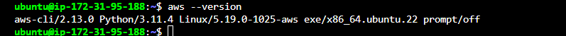
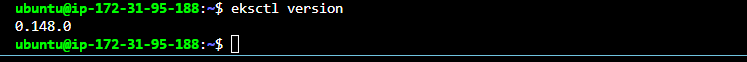
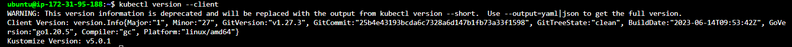
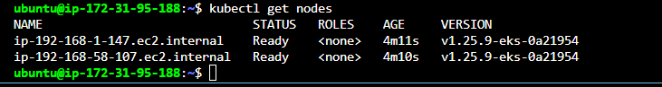

Create an EC2 Instance to act as our cloent machine

Type: t2.medium
AMI: Ubuntu 22.04

SSH into the instance and install;
AWSCLI,Kubectl and eksctl

INSTALL AWS CLI
```
curl "https://awscli.amazonaws.com/awscli-exe-linux-x86_64.zip" -o "awscliv2.zip" 

sudo apt install unzip

sudo unzip awscliv2.zip  

sudo ./aws/install

aws --version
```



INSTALL EKSCTL

```
curl --silent --location "https://github.com/weaveworks/eksctl/releases/latest/download/eksctl_$(uname -s)_amd64.tar.gz" | tar xz -C /tmp
sudo mv /tmp/eksctl /usr/local/bin
eksctl version
```


INSTALL KUBECTL
```
curl -s https://packages.cloud.google.com/apt/doc/apt-key.gpg | sudo apt-key add -

sudo touch /etc/apt/sources.list.d/kubernetes.list

echo "deb http://apt.kubernetes.io/ kubernetes-xenial main" | sudo tee -a /etc/apt/sources.list.d/kubernetes.list

sudo apt-get update

sudo apt-get install -y kubectl

```


LETS GIVE THE EC2 INSTA=NCE PRIVILEGES TO CREATE SERVICES ON OUR BEHALF
FOR THIS DEMO , I WILL GIVE FULL ADMIN ACCESS. GIVE LEAST PRIVILEGE IN PRODUCTION

We need to create Create IAM Role with Administrator Access
- Create an IAM role with AdministratorAccess policy.
- Go to AWS console > IAM > Roles. create a role
- Select AWS services, Click EC2, Click on Next permissions. AdministratorAccess policy and select
- Name your role and create it
Next, we need to assign the created role to our EC2 instance
- Go to AWS console > EC2 > EC2 instance > Security

- Click on Modify IAM Role

- Choose the role we created from the dropdown and click on Apply.

Our Instance can now request services on our behalf


LETS CREATE THE EKS CLUSTER WITH 2 WORKER NODES USING EKSCTL


```
eksctl create cluster --name demo-eks --region us-east-1 --nodegroup-name my-nodes --node-type t3.small --managed --nodes 2 
```
 CHECK TO SEE IF OUR CLUSTER IS READY

 ```
 kubectl get nodes
 ```
 

 