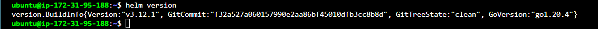
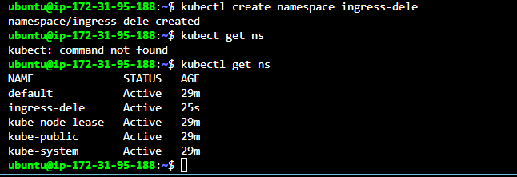
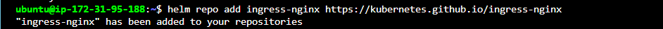
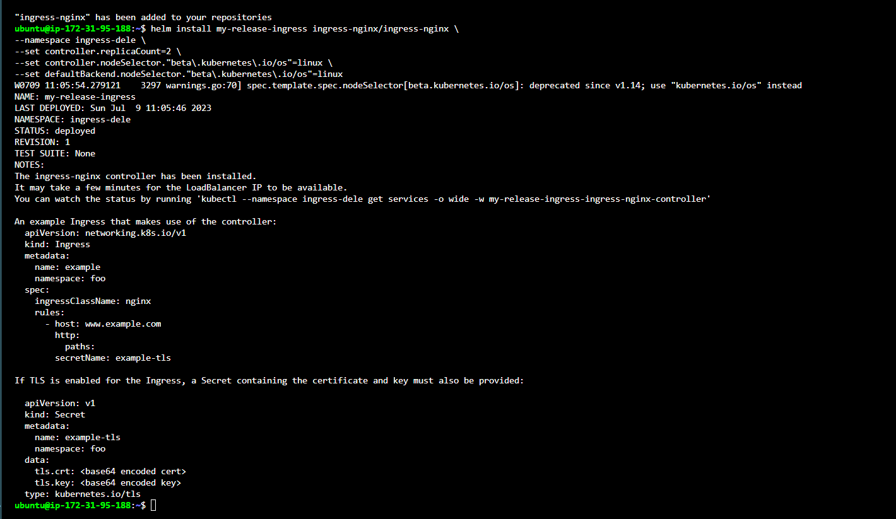
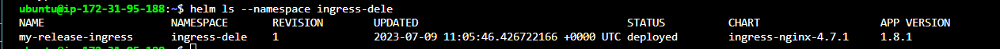
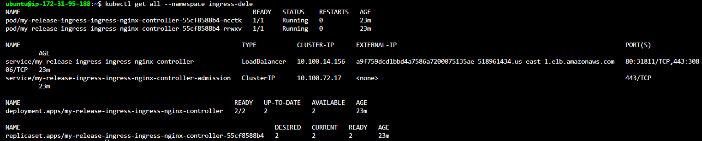
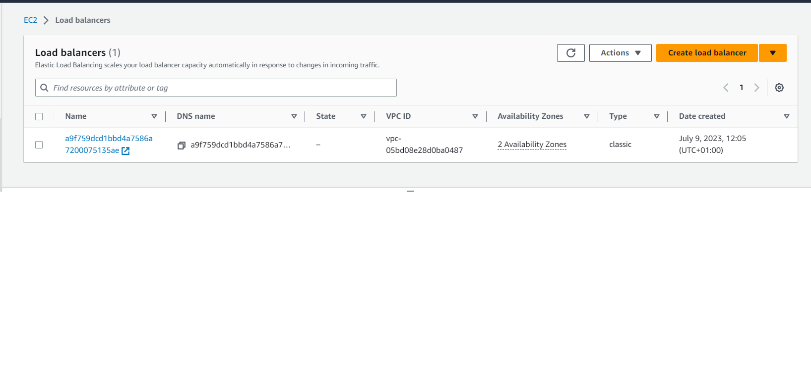
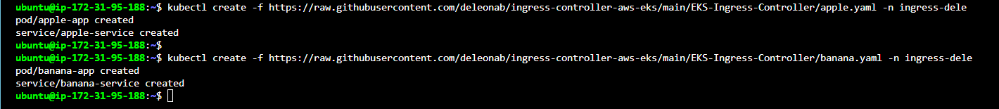

Create an EC2 Instance to act as our cloent machine

Type: t2.medium
AMI: Ubuntu 22.04

SSH into the instance and install;
AWSCLI,Kubectl and eksctl

INSTALL AWS CLI
```
curl "https://awscli.amazonaws.com/awscli-exe-linux-x86_64.zip" -o "awscliv2.zip" 

sudo apt install unzip

sudo unzip awscliv2.zip  

sudo ./aws/install

aws --version
```


INSTALL EKSCTL

```
curl --silent --location "https://github.com/weaveworks/eksctl/releases/latest/download/eksctl_$(uname -s)_amd64.tar.gz" | tar xz -C /tmp
sudo mv /tmp/eksctl /usr/local/bin
eksctl version
```


INSTALL KUBECTL
```
curl -s https://packages.cloud.google.com/apt/doc/apt-key.gpg | sudo apt-key add -

sudo touch /etc/apt/sources.list.d/kubernetes.list

echo "deb http://apt.kubernetes.io/ kubernetes-xenial main" | sudo tee -a /etc/apt/sources.list.d/kubernetes.list

sudo apt-get update

sudo apt-get install -y kubectl

```


LETS GIVE THE EC2 INSTA=NCE PRIVILEGES TO CREATE SERVICES ON OUR BEHALF
FOR THIS DEMO , I WILL GIVE FULL ADMIN ACCESS. GIVE LEAST PRIVILEGE IN PRODUCTION

We need to create Create IAM Role with Administrator Access
- Create an IAM role with AdministratorAccess policy.
- Go to AWS console > IAM > Roles. create a role
- Select AWS services, Click EC2, Click on Next permissions. AdministratorAccess policy and select
- Name your role and create it
Next, we need to assign the created role to our EC2 instance
- Go to AWS console > EC2 > EC2 instance > Security

- Click on Modify IAM Role

- Choose the role we created from the dropdown and click on Apply.

Our Instance can now request services on our behalf


LETS CREATE THE EKS CLUSTER WITH 2 WORKER NODES USING EKSCTL


```
eksctl create cluster --name demo-eks --region us-east-1 --nodegroup-name my-nodes --node-type t3.small --managed --nodes 2 
```
 CHECK TO SEE IF OUR CLUSTER IS READY

 ```
 kubectl get nodes
 ```
 


We shall be using help to deploy our Nginx ingress controller.

INSTALL HELM

```
sudo apt update

curl -fsSL -o get_helm.sh https://raw.githubusercontent.com/helm/helm/master/scripts/get-helm-3

chmod +x get_helm.sh

sudo ./get_helm.sh
```
Check installation
```
helm version
```



Before we install ingress, let's create a namespace for this

```
kubectl create namespace ingress-dele
```


Let's install the Nginx Ingree Controller using helm
```
helm repo add ingress-nginx https://kubernetes.github.io/ingress-nginx 
helm install my-release-ingress ingress-nginx/ingress-nginx \
--namespace ingress-dele \
--set controller.replicaCount=2 \
--set controller.nodeSelector."beta\.kubernetes\.io/os"=linux \
--set defaultBackend.nodeSelector."beta\.kubernetes\.io/os"=linux 

```




Verify if release installed

``` 
helm ls --namespace ingress-dele 
```


Next, let's check what resources are now in our namespace

```
kubectl get all --namespace ingress-dele
```



It has created 2 nginx cingress controller pods, a replicaset of 2 pods and 2 services
The first service is of type LoadBalancer

The second service is of type clusterIP

We can view the created LoadBalancer in our AWS Console
EC2 > Load Balancers



Next, I will create 2 pods in ingress-dele namespace (apple and banana), each with it's own service

Here is our apple mnifest file apple.yaml
```
apiVersion: v1
kind: Pod
metadata:
  name: apple-app
  labels:
    apps: apple
spec:
  containers:
  - name: apple-app
    image: hashicorp/http-echo
    args:
    - "-text=apple"

---
apiVersion: v1
kind: Service
metadata:
  name: apple-service
spec:
  selector:
    app: apple
  ports:
    - port: 5678
```

Here is the manifest file for banana.yaml

```
apiVersion: v1
kind: Pod
metadata:
  name: banana-app
  labels:
    apps: banana
spec:
  containers:
  - name: banana-app
    image: hashicorp/http-echo
    args:
    - "-text=banana"

---
apiVersion: v1
kind: Service
metadata:
  name: banana-service
spec:
  selector:
    app: banana
  ports:
    - port: 5678
```


https://raw.githubusercontent.com/deleonab/ingress-controller-aws-eks/main/EKS-Ingress-Controller/apple.yaml

kubectl create -f https://raw.githubusercontent.com/deleonab/ingress-controller-aws-eks/main/EKS-Ingress-Controller/banana.yaml -n ingress-dele



Now we have 4 pods running. 
2 ingress controller pods
2 applications ( banana-app and apple-app)

